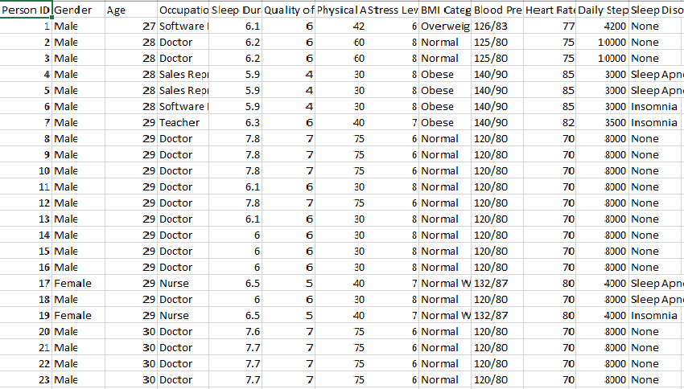
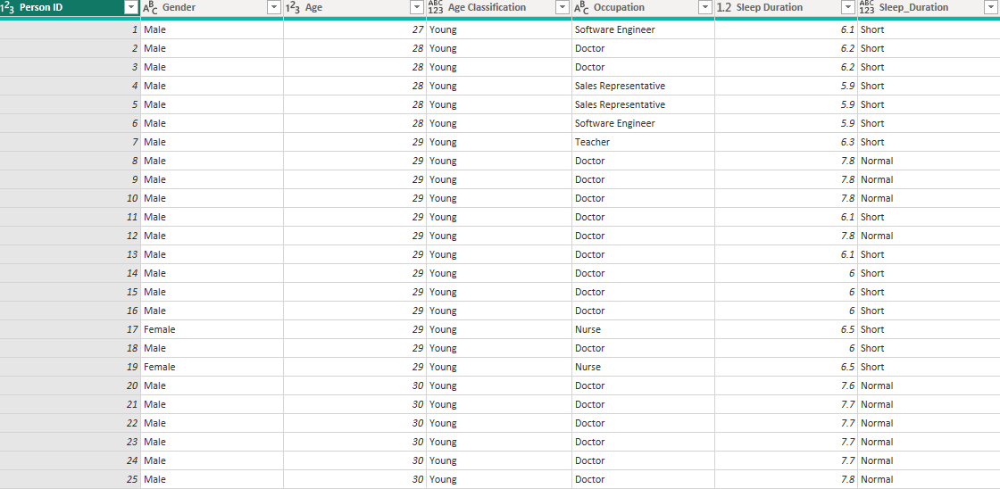
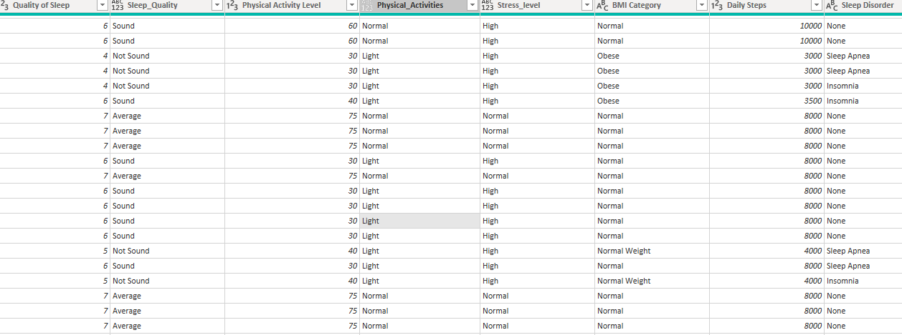
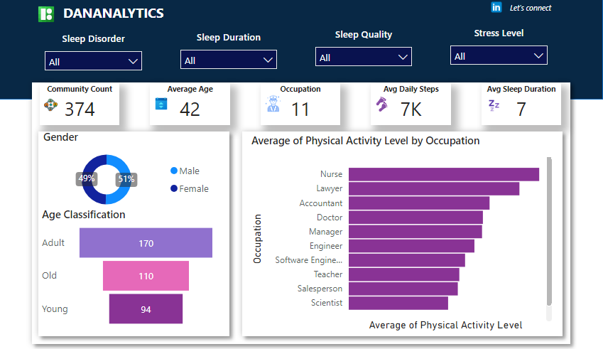

# COMMUNITY SLEEP ANALYSIS
---

---
## INTRODUCTION
Welcome to **DANANALYTICS**, This reports reveals the sleep and stress pattern for a community in Nigeria.
**_DISCLAIMER: This analysis does not reflect the true situation of any community in Nigeria.  It is for learning purposes_**

## PROBLEM STATEMENT
**DANANALYTICS** were tasked to dive into their sleep and stresss data of the community to dsicover:
1. Average Age
2. Total number of people in the community.
3. Highlight of Occupaton.
4. Average daily step 
5. Average Sleep Duration
6. Any other relevant data driven insight into their salary pattern.

## SKILLS DEMOSTRATED
- Data Cleaning and transformation
- User friendly dashboard design.
- Slicers design and incorporation
- Action Button
- Power Query

## DATA SOURCE
The data used in this analyis was downloaded from Kaggle database

## DATA TRANSFORMATION

Power query was used to clean and transformed this data. Some Columns were deleted and some where reclassified to further understand and analyse the data set. the conditional column in Power Query was used to reclassify the specific column

1. Age Classification: Young, Adult and Old
2. Sleep Duration:: Long, ShorT AND Normal
3. Sleep Quality: Average, Not Sound and Sound
4. Stress Level: High, Low and Normal

see pictures below
Dirty dataset     |     Transformed Datset with Power query 1 |  Transformed Datset with Power query 2
:-----------------:|:-----------------:|:-----------------:
|| 

## MODELLING
No specific modelling was used as the dataset had only one table.

## ANALYSIS AND VISUALISATION
**DANANALYTICS** discovered that 
1. Average Age = 42 years
2. Total number of people in the community = 374
3. Highlight of Occupation = 11
4. Average daily step = 7000
5. Average Sleep Duration = 7 hours

 check below for the dashboard picture.
 ---
 

## Conclusion/Recommendation.

To get the best of this visualisation, i will recommend you interact with the dashboard as a lot of insights lie there in.

**THANK YOU** 🙂

